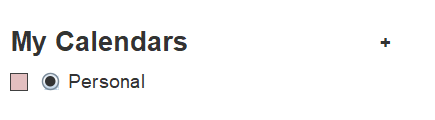
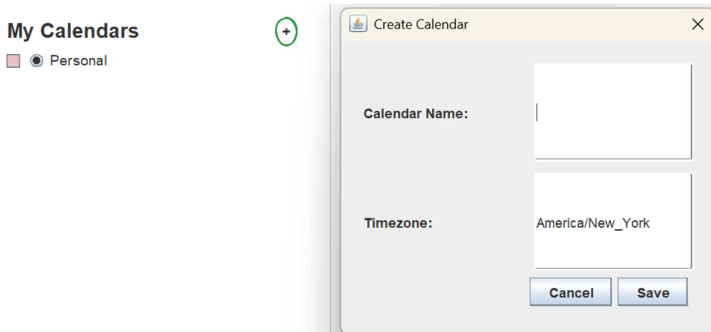
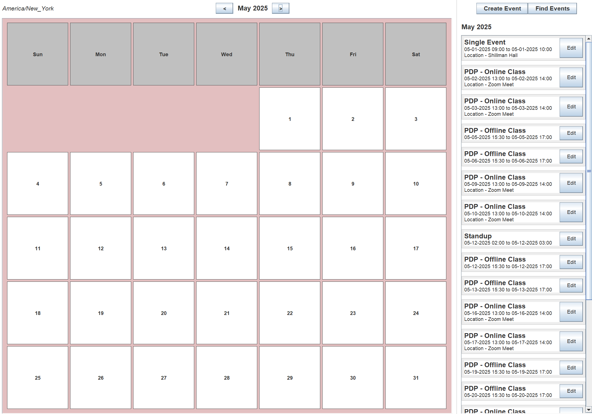
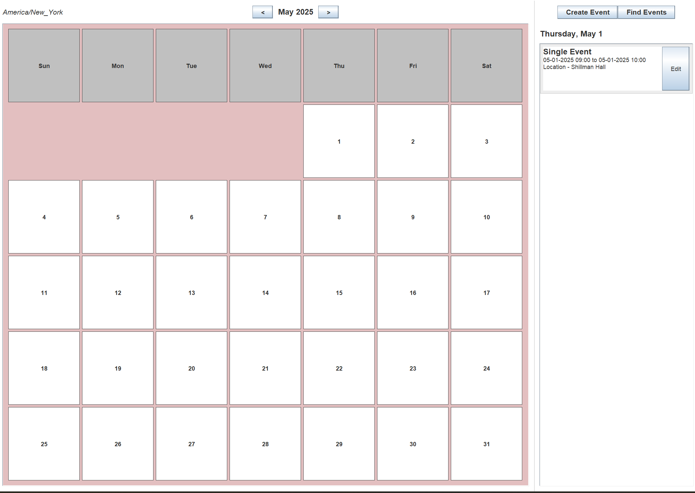
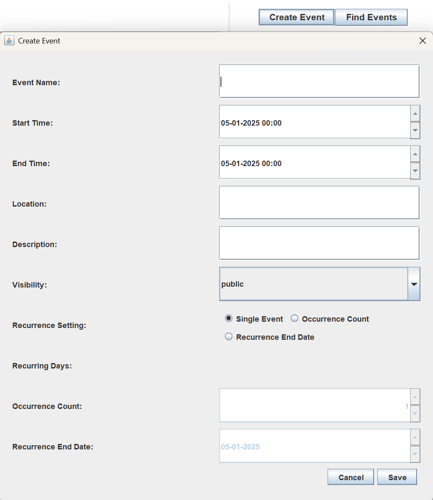
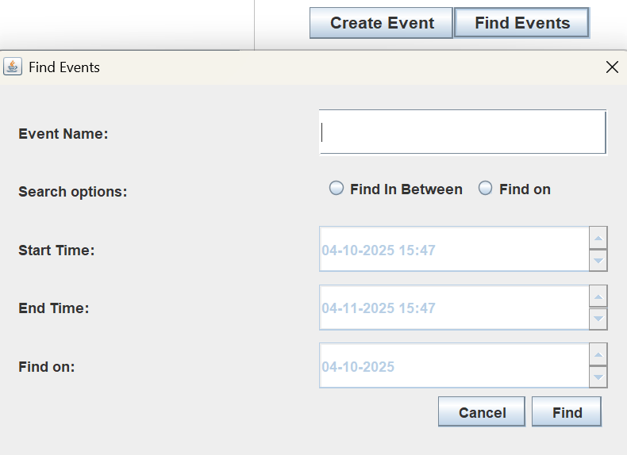
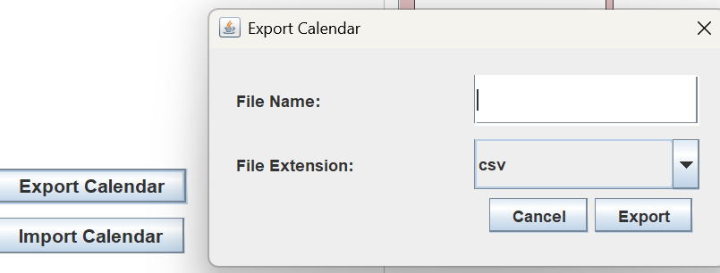
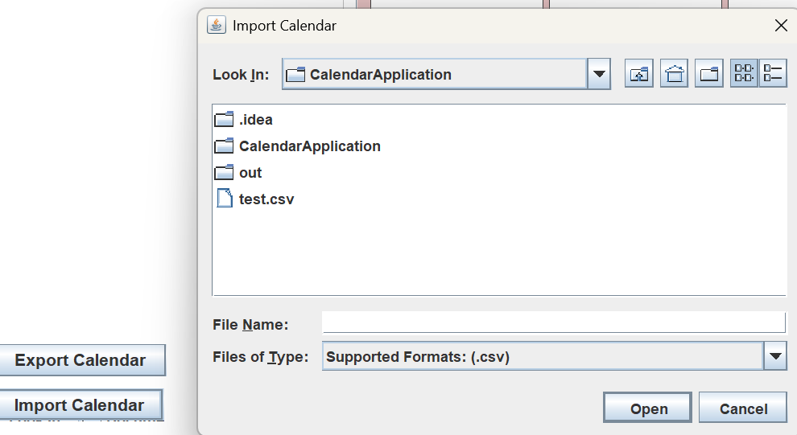

# USEME: Graphical User Interface (GUI)

This section explains how to use the application's GUI and its main features.

---

## 1. Default Calendar

By default, the **Personal** calendar will be active. You can see it in the **My Calendar** section,
as shown in the screenshot.

---

## 2. Create Calendar

To create a new calendar, click the **+ icon** (shown in the screenshot).  
Enter the **Calendar Name** and select the **Timezone**.

---

## 3. Choose a Calendar

You can select the calendar you want to use from the list.  
Each calendar has a **unique color code** to help you identify it easily.

---

## 4. View Calendar & Events

Use the **'<'** and **'>'** buttons to switch between months.  
The calendar is shown in **Month View**, as in the screenshot.  
You can click on any **day** to view the events for that day.  
By default, all events for the current month are visible in the view section.

---

## 5. Create Events

Click the **Create Event** button on the right (as shown in the screenshot).  
You can create both **single** and **recurring** events.  
All created events will appear in the calendar view.

---

## 6. Find Events

Click the **Find Events** button on the right (as shown in the screenshot).  
You can search for events using:

- **Event name**
- **Start date and End date** or **On date**

---

## 7. Export Calendar

Click the **Export Calendar** button (as shown in the screenshot).  
Enter a **file name** and **file extension**.  
Once exported, the path to the created file will be shown.

---

## 8. Import Calendar

Click the **Import Calendar** button (as shown in the screenshot).  
Choose a file from the file explorer dialog.  
Only files with **supported extensions** can be selected.  
After a successful import, all events will be visible in the calendar.

---

Refer to the screenshots in this file for visual guidance on each step.
